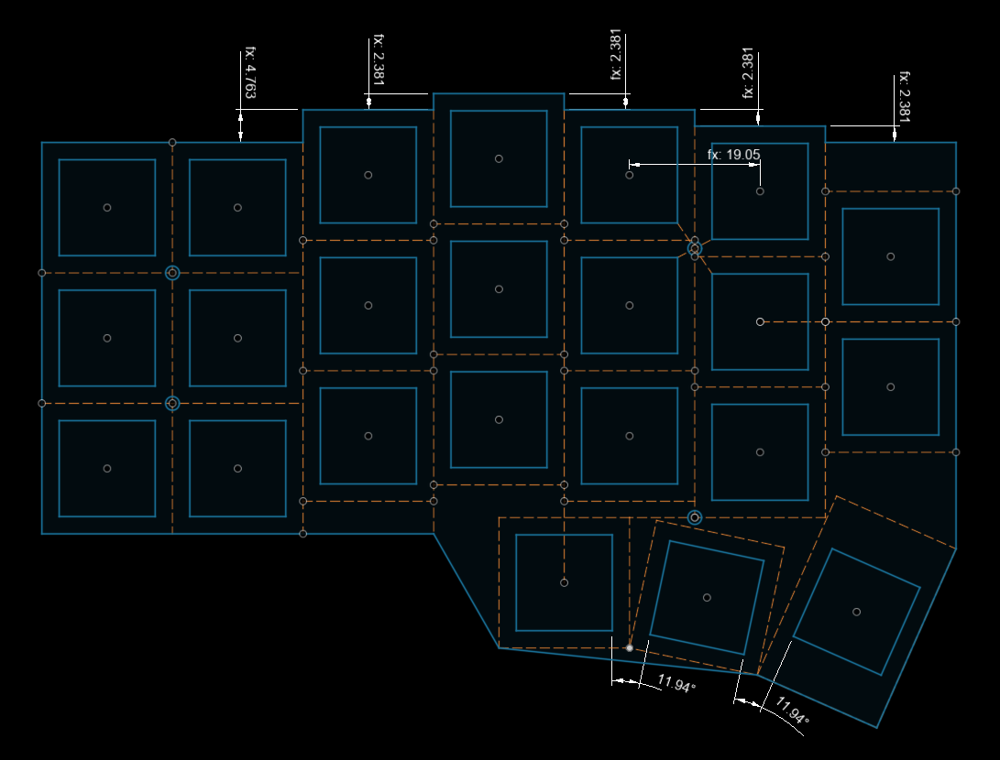
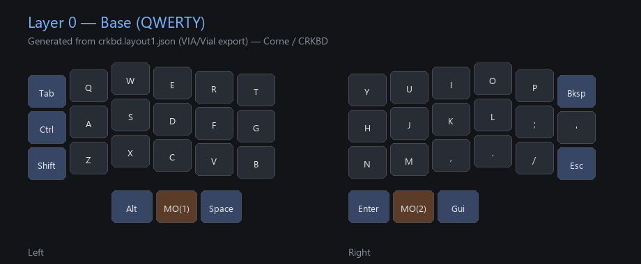
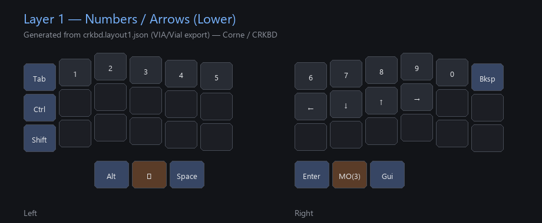
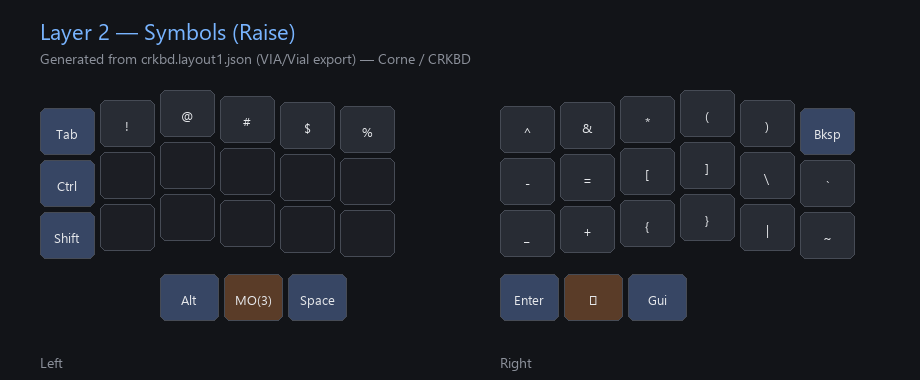
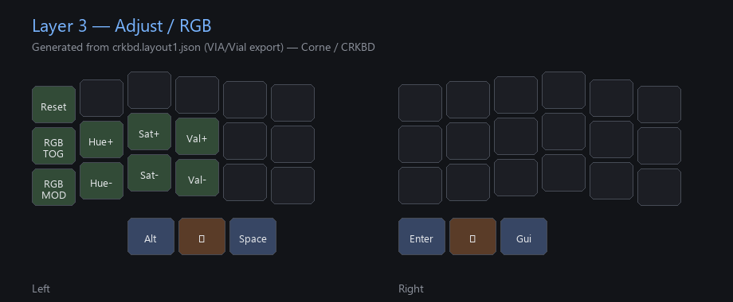

# Corne (CRKBD) Build Notes & Layout

Personal Corne / CRKBD assembly notes and VIA/Vial keymap by **Jose I. Montero**.

This repo documents a **follow-along build**: how I assembled a Corne-style split keyboard and configured layers using community hardware, guides, and the VIA/Vial ecosystem. It is **not** an original keyboard design.

**Repo:** [github.com/2eezy77/crkbd_layout](https://github.com/2eezy77/crkbd_layout)

---

## What this is

| Item | Detail |
|------|--------|
| Keyboard | Corne (CRKBD) — split 3×6 + 3 thumb keys |
| Layout file | [`crkbd.layout1.json`](crkbd.layout1.json) (VIA/Vial export) |
| Config tools | [VIA](https://www.caniusevia.com/) / [Vial](https://get.vial.today/) |
| Author | Jose I. Montero |

Use the JSON with a compatible Corne firmware that supports VIA or Vial, then tweak layers live in the GUI.

---

## Credit — not my original design

I did **not** invent the Corne keyboard, the PCB, or the VIA/Vial tooling.

- **Corne / CRKBD** design and documentation: [foostan/crkbd](https://github.com/foostan/crkbd) (foostan), based on Helix. Hardware docs and drawings there are shared under **[CC BY 4.0](https://creativecommons.org/licenses/by/4.0/)**.
- **Layout / remapping**: community guides plus the open **VIA / Vial** ecosystem on top of QMK-style firmware.
- My contribution here is documenting **my assembly choices**, **parts**, and **the keymap I ended up with** after following others.

If you are building your own, start from foostan’s guides and a trusted vendor kit; treat this README as a personal build log.

---

## Parts & build choices

| Part / choice | Notes |
|---------------|--------|
| **Controller** | **RP2040 Pro Micro** (or compatible RP2040 Pro Micro footprint boards) on each half |
| **Keycaps** | **Lame keycaps** (set used on this build) |
| **Tilt / tenting** | Case or plate **tilt** for a more neutral wrist angle (better ergonomics at the desk) |
| **Response tuning** | Firmware debounce / scan tuned toward ~**3 ms** key latency for snappier typing (exact value depends on your firmware build; not stored in the VIA JSON export) |

Other usual Corne bits (switches, diodes, TRRS/USB-C interconnect, plates/case) follow whatever kit or community BOM you use. This repo focuses on layout + build notes, not a full shopping list.

---

## PCB diagram (community source)

Official-style Corne geometry sketch from the upstream **foostan/crkbd** project (PCB/plate layout for one half: 3×6 + thumb cluster). Used here for illustration only; **not** my artwork.



**Source:** [foostan/crkbd](https://github.com/foostan/crkbd) — image from the project README (“Drawing” / sketch).  
**License:** [CC BY 4.0](https://creativecommons.org/licenses/by/4.0/) — © foostan / Corne contributors.  
**Asset URL:** `https://github.com/foostan/crkbd/assets/736191/87ebea53-3c5c-42a1-97b3-f9292e4dacae`

---

## Layers (Vial / VIA style maps)

Vial was not available as a desktop app on the machine used to refresh this docs set, so the maps below are **clean visual layer diagrams generated from** [`crkbd.layout1.json`](crkbd.layout1.json) in the same Corne left/right arrangement you see in VIA/Vial.

### Layer 0 — Base (QWERTY)



- Alphas: QWERTY with outer columns for `Tab` / `Ctrl` / `Shift` (left) and `Bksp` / `'` / `Esc` (right).
- Thumbs: `Alt` · `MO(1)` · `Space` (left) · `Enter` · `MO(2)` · `Gui` (right).

### Layer 1 — Numbers / arrows (`MO(1)` hold)



- Number row `1`–`0`, arrow cluster on the right home row area, `MO(3)` on the right raise thumb while Lower is held.

### Layer 2 — Symbols (`MO(2)` hold)



- Shifted number symbols (`!` `@` `#` …), brackets, and related punctuation.

### Layer 3 — Adjust / RGB



- `Reset` plus RGB toggle/mod and HSV controls (VIA codes as exported in the JSON).

---

## Files

```
crkbd.layout1.json          # VIA/Vial keymap export
docs/pcb/                   # Attributed Corne PCB sketch
docs/vial-layers/           # Layer 0–3 maps from the JSON
README.md                   # This build log
```

---

## How to use the layout

1. Flash compatible Corne / CRKBD firmware with VIA or Vial support (RP2040 Pro Micro builds are common in the community).
2. Open VIA or Vial, connect the keyboard.
3. Load / paste [`crkbd.layout1.json`](crkbd.layout1.json), or remake the layers to match the diagrams above.
4. Adjust debounce / latency in firmware if you want the ~3 ms feel described in the parts table.

---

## License & attribution reminder

- **Upstream Corne design & sketch image:** foostan/crkbd, [CC BY 4.0](https://creativecommons.org/licenses/by/4.0/).
- **Keymap JSON and this README:** personal build documentation by Jose I. Montero — free to reuse for learning; please keep upstream credits if you fork.
